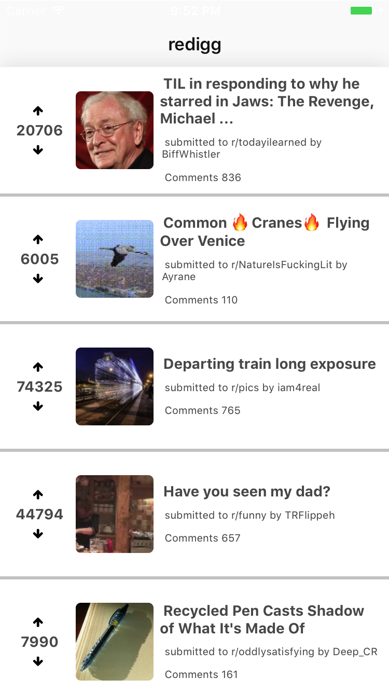

#  redigg


> Reddit clone reimagined with React Native and Redux

## Table of Contents

1. [Owner](#owner)
1. [Usage](#usage)
1. [Requirements](#requirements)
1. [Development](#development)
    1. [Installing Dependencies](#arrow_up-installing-dependencies)
    1. [Tasks](#arrow_up-installing-dependencies)
    1. [Secrets](#closed_lock_with_key-secrets)
    1. [Tech Stack](#tech-stack)
    1. [Roadmap](#roadmap)


## Owner
  - [Sean O'Neal](https://github.com/sean-oneal)

## Usage

## Requirements
  - [Homebrew](https://brew.sh)
  - [React Native CLI](https://facebook.github.io/react-native/docs/getting-started.html#content)
  - [Node v8.2.x](https://nodejs.org/en/)
  - [Watchman](https://facebook.github.io/watchman/)
  - [yarn](https://yarnpkg.com/en/)
  - Xcode 8.x via [Mac App Store](https://itunes.apple.com/us/app/xcode/id497799835?mt=12)
    * Xcode Command Line Tools is also required


## Development

* The application was developed as a native application for iOS and Android devices. The application features persistent local storage of post data.  Users can update the content by pulling down on the list

### :arrow_up: Installing Dependencies

**Step 1:** git clone this repo:

**Step 2:** cd to the cloned repo:

**Step 3:** Install the Application with `yarn` or `npm i`


### :arrow_forward: Tasks

1. cd to the repo
2. Run Build for either OS
  * for iOS
    * run `react-native run-ios`
  * for Android
    * Run Genymotion
    * run `react-native run-android`


### :closed_lock_with_key: Secrets

This application uses [react-native-config](https://github.com/luggit/react-native-config) to expose config variables React Native. API keys and other sensitive information can be stored in a `.env` file:

```
API_URL=https://myapi.com
MY_API_KEY=abcdefgh
```

Secret Keys can be accessed from React Native like so:

```
import Secrets from 'react-native-config'

Secrets.API_URL  // 'https://myapi.com'
Secrets.MY_API_KEY  // 'abcdefgh'
```

The `.env` file is ignored by git keeping those secrets out of your repo.

### Tech Stack

  - React Native
  - React Native Navigation
  - Redux
  - Redux Saga
  - Redux Persist
  - Enzyme
  - Jest
  - Lodash
  - Ignite 2.0
  - api-sauce
  - redux-sauce

### Roadmap

View the project roadmap [here](https://github.com/sean-oneal/redigg/issues)


